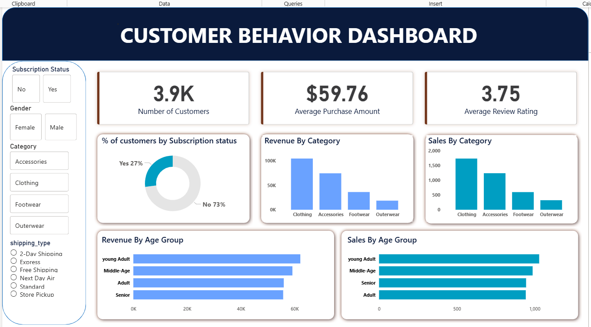

# 🛒 ConsumerPulse: End-to-End Customer Behavior Analytics

**📌 Project Overview**

This project provides a comprehensive analysis of customer shopping behavior using transactional data from 3,900 purchases across various product categories. The primary objective was to uncover actionable insights into spending patterns, customer segmentation, and product preferences to drive strategic business decisions.

# Tech Stack

Data Cleaning & Prep: Python (Pandas).

Database Management: MYSQL.

Data Visualization: Power BI.

**1. Data Preparation (Python)**

-The raw dataset consisted of 3,900 rows and 18 columns, covering demographics, purchase details, and shopping behavior.

-Missing Data Imputation: Handled 37 missing values in the "Review Rating" column by using the median rating for each product category.

-Feature Engineering: Created an age_group column by binning customer ages and a purchase_frequency_days column to track behavior.

-Column Standardization: Converted all column names to snake_case for better documentation and SQL compatibility.

-Database Integration: Cleaned data was loaded into a PostgreSQL database to perform complex structured queries.

**2. Structured Data Analysis (SQL)**

-We executed several business-critical queries in MYSQL to analyze performance:

-Revenue Analysis: Found that Male customers generated significantly higher revenue ($157,890) compared to Female customers ($75,191).

-Customer Segmentation: Classified the user base into "Loyal" (3,116), "Returning" (701), and "New" (83) segments.

-Subscription Insights: Only 27% of customers are currently subscribers. Interestingly, non-subscribers have a slightly higher average spend ($59.87) than subscribers ($59.49).

-Top Performance: Identified "Gloves" as the top-rated product (3.86) and "Jewelry" as the most purchased item in the Accessories category.

 **3. Interactive Dashboard (Power BI)**

-The final stage involved building a dynamic Power BI dashboard to visualize:

-KPIs: Number of Customers (3.9K), Average Purchase Amount ($59.76), and Average Review Rating (3.75).

-Category Performance: "Clothing" was identified as the leading category for both revenue and sales volume.

-Demographic Contribution: "Young Adults" were the highest revenue-contributing age group ($62,143).

# 💡 Business Recommendations

**Boost Subscriptions**

-Target the 73% non-subscriber base with exclusive benefits and offers.

**Loyalty Programs**

-Incentivize Returning customers to move into the Loyal segment.

**Targeted Marketing**

-Focus campaigns on:
   -High-revenue Young Adult customers
  -Customers preferring Express Shipping

# 🚀 Key Takeaway

This project demonstrates the complete analytics lifecycle — from raw data cleaning and SQL analysis to business insights and executive-ready dashboards — making it highly relevant for Data Analyst / Business Analyst roles.

Targeted Marketing: Focus campaigns on high-revenue groups like "Young Adults" and users who prefer "Express Shipping"
